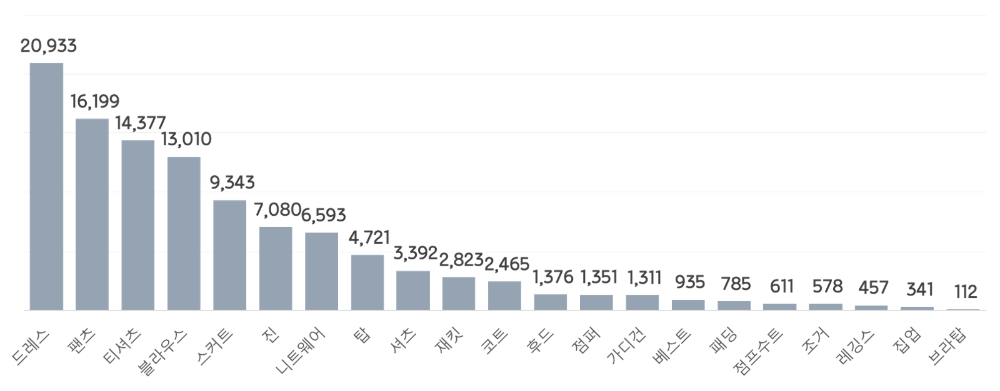

# Environment

- Version
    - `torch 1.6.0`, `cu101` 


# Build Detectron2 Using Docker

- refered from [Facebook github](https://github.com/facebookresearch/detectron2)
    
```shell
# build image
docker build --build-arg USER_ID=$UID -t fashion ./docker

```


```shell
# build container from the image
docker run --gpus all -it -p 8282:8282 -p 6006:6006 --shm-size=8gb --env="DISPLAY" -v ~/Documents/dataset/fashion/:/home/appuser/fashion_repo/dataset --name=fashion fashion:latest 
```

- `~/Documents/dataset/fashion/`: your data path in host
- `/home/appuser/fashion_repo/dataset`: your data path in docker

```shell
# Access to container
docker exec -it fashion bash
```

# Dataset

- Deepfashion-v2 (*landmark task*)
    - https://github.com/switchablenorms/DeepFashion2 
- Kfashion
    - https://drive.google.com/file/d/1Dz4k_MesgG2Uqno-LzrS7ebPqKG8p0XZ/view?usp=sharing



# Segmentation Task
- Cascade mask rcnn


- Train/Test Cascade mask rcnn fine-tuning on *DeepfashionV2*
    - completed model: [Deepfashion_cascade_mask_rcnn](http://drive.google.com/uc?export=view&id=1D4YgJw9-IsN2VTDKUdeBn0FMIeBtmYJ8)
    - its results: [Deepfashion_cascade_mask_rcnn](https://drive.google.com/file/d/1FSnYl10_I2A-dhpu75YSOJVG6lAYFXLJ/view?usp=sharing)

```shell
sh script/run_seg_deepfahsion_cascade.sh 
```

- Train/Test Cascade mask rcnn further fine-tuning on *Kfashion*
    - completed model: [kfashion_cascade_mask_rcnn](https://drive.google.com/file/d/1h_BIcdZUl98zghhcmtRntdGHISp_GH5g/view?usp=sharing)
    - its results: [kfashion_cascade_mask_rcnn](https://drive.google.com/file/d/1kqwq6PFUT3cvV7wUfqNhVbwLK-w9y-NW/view?usp=sharing)

```shell
sh script/run_seg_deepfahsion_cascade.sh 
```

- Output


# Performance for Deepfashion-v2

- Distribution of instances among all 13 categories for training :

|   category    | #instances   |   category    | #instances   |   category    | #instances   |
|:-------------:|:-------------|:-------------:|:-------------|:-------------:|:-------------|
| short sleev.. | 71645        | long sleeve.. | 36064        | short sleev.. | 543          |
| long sleeve.. | 13457        |     vest      | 16095        |     sling     | 1985         |
|    shorts     | 36616        |   trousers    | 55387        |     skirt     | 30835        |
| short sleev.. | 17211        | long sleeve.. | 7907         |  vest dress   | 17949        |
|  sling dress  | 6492         |               |              |               |              |
|     total     | 312186       |               |              |               |              |


- Evaluation results for bbox:

|   AP   |  AP50  |  AP75  |  APs  |  APm   |  APl   |
| :----: | :----: | :----: | :---: | :----: | :----: |
| 55.866 | 67.401 | 62.356 | 0.228 | 31.682 | 57.903 |

- Per-category bbox AP:

| category            | AP     | category          | AP     | category             | AP     |
| :------------------ | :----- | :---------------- | :----- | :------------------- | :----- |
| short sleeve top    | 84.388 | long sleeve top   | 64.570 | short sleeve outwear | 7.145  |
| long sleeve outwear | 22.648 | vest              | 64.892 | sling                | 41.982 |
| shorts              | 68.366 | trousers          | 67.217 | skirt                | 72.668 |
| short sleeve dress  | 67.721 | long sleeve dress | 45.859 | vest dress           | 66.793 |
| sling dress         | 52.014 |                   |        |                      |        |

- Evaluation results for segm:

|   AP   |  AP50  |  AP75  |  APs  |  APm   |  APl   |
| :----: | :----: | :----: | :---: | :----: | :----: |
| 52.244 | 66.834 | 61.169 | 0.000 | 22.458 | 54.445 |

- Per-category segm AP:

| category            | AP     | category          | AP     | category             | AP     |
| :------------------ | :----- | :---------------- | :----- | :------------------- | :----- |
| short sleeve top    | 79.983 | long sleeve top   | 58.647 | short sleeve outwear | 5.507  |
| long sleeve outwear | 18.926 | vest              | 61.006 | sling                | 36.943 |
| shorts              | 64.316 | trousers          | 59.996 | skirt                | 71.021 |
| short sleeve dress  | 64.007 | long sleeve dress | 42.682 | vest dress           | 62.124 |
| sling dress         | 54.019 |                   |        |                      |        |
# Performance for Kfashion

- Distribution of instances among all 21 categories for training :

|   category    | #instances | category | #instances | category | #instances |
| :-----------: | :--------- | :------: | :--------- | :------: | :--------- |
|   cardigan    | 133        | knitwear | 662        |  dress   | 2042       |
|   leggings    | 43         |   vest   | 99         |  bratop  | 14         |
|    blouse     | 1281       |  shirts  | 344        |  skirt   | 957        |
|    jacket     | 267        |  jumper  | 149        | jumpsuit | 81         |
| jogger pants  | 68         |  zipup   | 28         |   jean   | 698        |
|     coat      | 234        |   top    | 453        | t-shirts | 1514       |
| padded jacket | 66         |  pants   | 1592       |  hoody   | 156        |
|               |            |          |            |          |            |
|     total     | 10881      |          |            |          |            |

- Evaluation results for bbox:

|   AP   |  AP50  |  AP75  |  APs   |  APm   |  APl   |
| :----: | :----: | :----: | :----: | :----: | :----: |
| 59.341 | 72.345 | 66.059 | 50.000 | 56.079 | 59.267 |

- Per-category bbox AP:

| category      | AP     | category | AP     | category | AP     |
| :------------ | :----- | :------- | :----- | :------- | :----- |
| cardigan      | 51.548 | knitwear | 69.198 | dress    | 83.673 |
| leggings      | 41.134 | vest     | 56.446 | bratop   | 48.868 |
| blouse        | 68.417 | shirts   | 45.178 | skirt    | 72.048 |
| jacket        | 58.181 | jumper   | 54.128 | jumpsuit | 56.432 |
| jogger pants  | 44.613 | zipup    | 34.958 | jean     | 70.600 |
| coat          | 78.221 | top      | 32.488 | t-shirts | 65.541 |
| padded jacket | 83.620 | pants    | 64.075 | hoody    | 66.799 |


- Evaluation results for segm:

|   AP   |  AP50  |  AP75  |  APs   |  APm   |  APl   |
| :----: | :----: | :----: | :----: | :----: | :----: |
| 51.726 | 71.804 | 58.591 | 30.000 | 44.805 | 51.682 |

- Per-category segm AP:

| category      | AP     | category | AP     | category | AP     |
| :------------ | :----- | :------- | :----- | :------- | :----- |
| cardigan      | 37.292 | knitwear | 65.304 | dress    | 77.239 |
| leggings      | 26.938 | vest     | 42.535 | bratop   | 46.223 |
| blouse        | 61.723 | shirts   | 41.485 | skirt    | 71.209 |
| jacket        | 45.287 | jumper   | 44.823 | jumpsuit | 47.319 |
| jogger pants  | 40.278 | zipup    | 29.540 | jean     | 61.408 |
| coat          | 69.032 | top      | 29.066 | t-shirts | 58.393 |
| padded jacket | 74.742 | pants    | 55.881 | hoody    | 60.534 |


# Recommendation Task


- Train/Test combined global descriptors on *Kfashion* using *Cascade mask rcnn*
    - completed model: [cgd_model.pt](https://drive.google.com/file/d/1h_BIcdZUl98zghhcmtRntdGHISp_GH5g/view?usp=sharing)
    - its results: [feature_extraction](https://drive.google.com/file/d/1OOjOxvDOVQa8mAQnLN0D6wRkcf-yU2Fi/view?usp=sharing)

```shell
sh script/run_cgd_extraction.sh 
```


- Get items by using cosine similarities, and evaluation  

    - CGD evaluation
    

    |      k    |     Recall@k    |     Hit@k    |     MRR@k    |
    |:---------:|:---------------:|:------------:|:------------:|
    |      1    |       12.84     |     57.76    |     57.76    |
    |      2    |       18.33     |     63.95    |      686     |
    |      5    |       27.93     |      79.9     |     62.82    |
    |     10    |       34.77     |     77.23    |     63.55    |
    |     20    |       41.61     |     81.57    |     63.85    |

    
    - CGD + *whitened PCA* evaluation
    

    |      k    |     Recall@k    |     Hit@k    |     MRR@k    |
    |:---------:|:---------------:|:------------:|:------------:|
    |      1    |       13.64     |     62.22    |     62.22    |
    |      2    |       19.92     |     68.02    |     65.12    |
    |      5    |        382      |     74.16    |     66.84    |
    |     10    |       38.56     |     81.02    |     67.67    |
    |     20    |       44.60     |     84.56    |     67.92    |

---

# Extract Segmented Image for DB


- [segmented images](https://drive.google.com/file/d/1IKSz-7P3ToUg76kS6QDwr-vmdxkJ6Ukw/view?usp=sharing) for *Kfashion*, extracted by *Cascade mask rcnn*

```shell
sh script/run_seg_image.sh 
```

- Output


